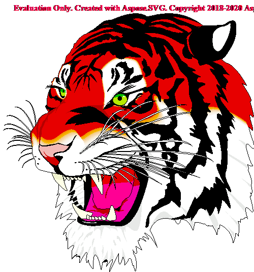
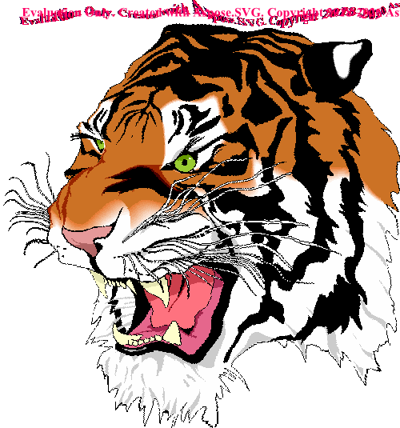
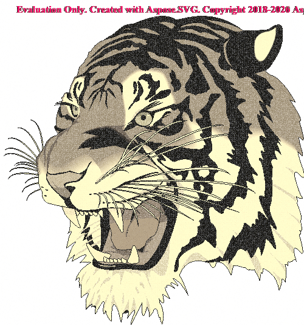
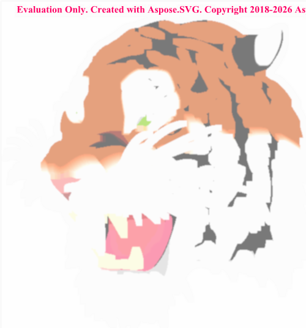
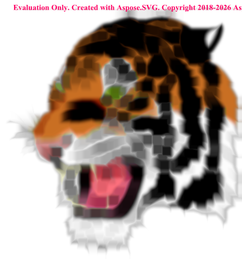
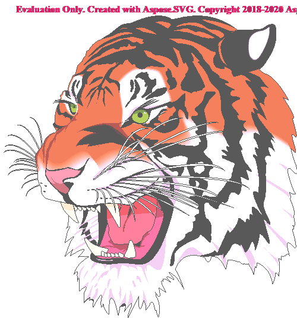

# Photo Effects with SVG Filters

This example shows how to use **Aspose.SVG for .NET** to apply SVG filter effects to raster images. The program loads a bitmap image, places it into a temporary SVG document as an `<image>` element, applies one of the filters from `filters.svg`, and renders the result back to an image file.

The example is useful when you want to demonstrate that SVG filters are not limited to vector artwork. They can also be used as a compact image-processing pipeline for ordinary files such as BMP, PNG, or JPEG.

## What Is Included

| File or folder | Purpose |
| --- | --- |
| `Program.cs` | Console application that parses command-line arguments, builds an SVG document, applies a filter, and saves the rendered image. |
| `PhotoEffects.csproj` | .NET project file. It references `Aspose.SVG` and copies `filters.svg` to the build output directory. |
| `filters.svg` | A small SVG filter library. Each `<filter>` element has an `id` that can be passed through the `--filter` option. |
| `demos/tiger.bmp` | Source image used by the demo. |
| `demos/*.bmp` | Existing bitmap outputs generated with the sample filters. |
| `demos/*.png` | PNG previews used by this README for GitHub-friendly rendering. |

## Filter Gallery

The following previews were generated from `demos/tiger.bmp` by running this sample application.

| Instagram | DistortionMirror | Vintage |
| --- | --- | --- |
|  |  |  |

| Retro | BlurredLights | BrushStrokes | Movie |
| --- | --- | --- | --- |
|  |  |  |  |

## Requirements

- .NET SDK 6.0 or later
- NuGet package restore access for `Aspose.SVG`
- Windows is recommended for this specific sample because it uses `System.Drawing.Image.FromFile()` to read the source image dimensions.

The project targets `net6.0` so it can be built with the .NET 6 SDK. If you change the target framework to `net8.0`, you must also install a .NET SDK that supports .NET 8.

## Run the Example

From the repository root:

```bash
dotnet run --project Examples/CSharp/PhotoEffects/PhotoEffects.csproj -- \
  --source Examples/CSharp/PhotoEffects/demos/tiger.bmp \
  --filter Vintage \
  --output Examples/CSharp/PhotoEffects/demos/tiger-vintage-output.png
```

On Windows PowerShell, use a single line:

```powershell
dotnet run --project Examples\CSharp\PhotoEffects\PhotoEffects.csproj -- --source Examples\CSharp\PhotoEffects\demos\tiger.bmp --filter Vintage --output Examples\CSharp\PhotoEffects\demos\tiger-vintage-output.png
```

You can also use short option names:

```powershell
dotnet run --project Examples\CSharp\PhotoEffects\PhotoEffects.csproj -- -s Examples\CSharp\PhotoEffects\demos\tiger.bmp -f Movie -o Examples\CSharp\PhotoEffects\demos\tiger-movie-output.png
```

## Run from Visual Studio

If you start the console application without command-line arguments, it prints the help screen and reports that `--source`, `--output`, and `--filter` are missing. This is expected because the sample needs to know which image and which SVG filter to use.

The project includes `Properties/launchSettings.json` with demo arguments for Visual Studio debugging:

```text
--source demos\tiger.bmp --filter Vintage --output demos\tiger-vintage-debug.png
```

Select the `PhotoEffects` launch profile and press F5 to run the sample with the bundled tiger image.

## Command-Line Options

| Option | Required | Description |
| --- | --- | --- |
| `-s`, `--source` | Yes | Path to the source raster image. |
| `-f`, `--filter` | Yes | Filter ID from `filters.svg`. Filter names are case-sensitive. |
| `-o`, `--output` | Yes | Path to the output image file. The output format is selected from the file extension. |

Available filters:

- `Instagram`
- `DistortionMirror`
- `Vintage`
- `Retro`
- `BlurredLights`
- `BrushStrokes`
- `Movie`

## How It Works

The sample does not modify the source image directly. Instead, it creates a temporary SVG document in memory:

```xml
<svg width="..." height="...">
  <g filter="url(#Vintage)">
    <image href="..." width="..." height="..." />
  </g>

  <filter id="Vintage">
    ...
  </filter>
</svg>
```

The main steps are:

1. `CommandLineParser` reads the `source`, `filter`, and `output` command-line arguments.
2. `SVGDocument` creates an empty SVG document.
3. The source image path is converted to an absolute path and inserted into the SVG as an `<image>` element.
4. The program reads the source image dimensions and applies them to both the `<image>` element and the root `<svg>` element.
5. `filters.svg` is loaded from the application output directory.
6. The selected `<filter>` element is found by `id` and appended to the generated SVG document.
7. The filter is applied to the `<g>` element through `filter="url(#FilterId)"`.
8. `Converter.ConvertSVG()` renders the filtered SVG into the output image file.

The sample limits very large input images to a maximum side length of 2000 pixels while preserving the aspect ratio. This keeps the demo fast and avoids unexpectedly large output files.

## The `filters.svg` File

`filters.svg` acts as a reusable filter repository. Each filter is a normal SVG `<filter>` element:

```xml
<filter id="Movie" x="0%" y="0%" width="100%" height="100%">
  <feComponentTransfer>
    <feFuncR offset=".1" exponent="1.2" amplitude="1.5" type="gamma" />
    <feFuncG offset=".1" exponent="1.2" amplitude="1" type="gamma" />
    <feFuncB offset=".1" exponent="1.2" amplitude="1.5" type="gamma" />
  </feComponentTransfer>
</filter>
```

To add your own effect:

1. Add a new `<filter id="MyFilter">...</filter>` element to `filters.svg`.
2. Build or run the project so `filters.svg` is copied to the output directory.
3. Pass the new ID on the command line:

```powershell
dotnet run --project Examples\CSharp\PhotoEffects\PhotoEffects.csproj -- -s Examples\CSharp\PhotoEffects\demos\tiger.bmp -f MyFilter -o Examples\CSharp\PhotoEffects\demos\tiger-my-filter.png
```

## Notes

- `filters.svg` is copied to the application output directory by `PhotoEffects.csproj`. The program loads it from `AppContext.BaseDirectory`, so it works when launched from the repository root or from the project folder.
- If you run the example without an Aspose.SVG license, the rendered image may contain an evaluation watermark.
- If the selected filter ID is not found, the program throws a clear error instead of failing later during rendering.
- If Visual Studio or another MSBuild process locks files in `bin` or `obj`, close the process or run with `-p:UseAppHost=false`:

```powershell
dotnet run --project Examples\CSharp\PhotoEffects\PhotoEffects.csproj -p:UseAppHost=false -- -s Examples\CSharp\PhotoEffects\demos\tiger.bmp -f Vintage -o Examples\CSharp\PhotoEffects\demos\tiger-vintage-output.png
```
